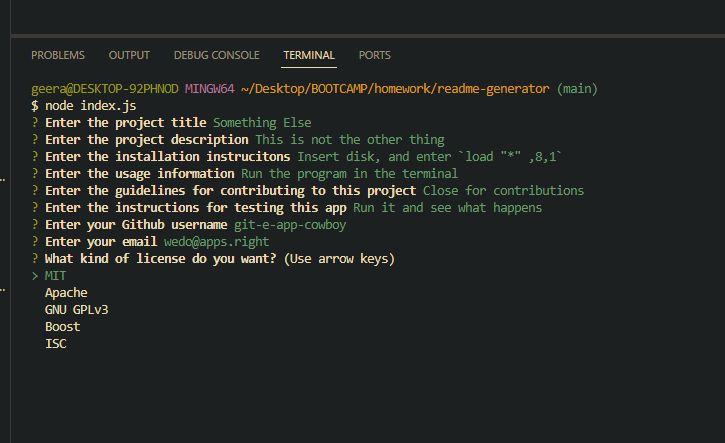
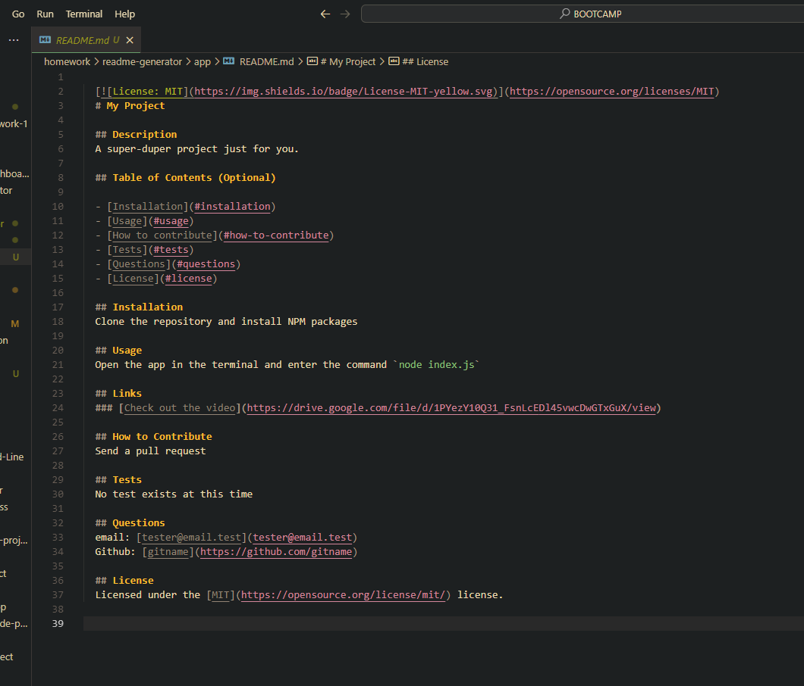
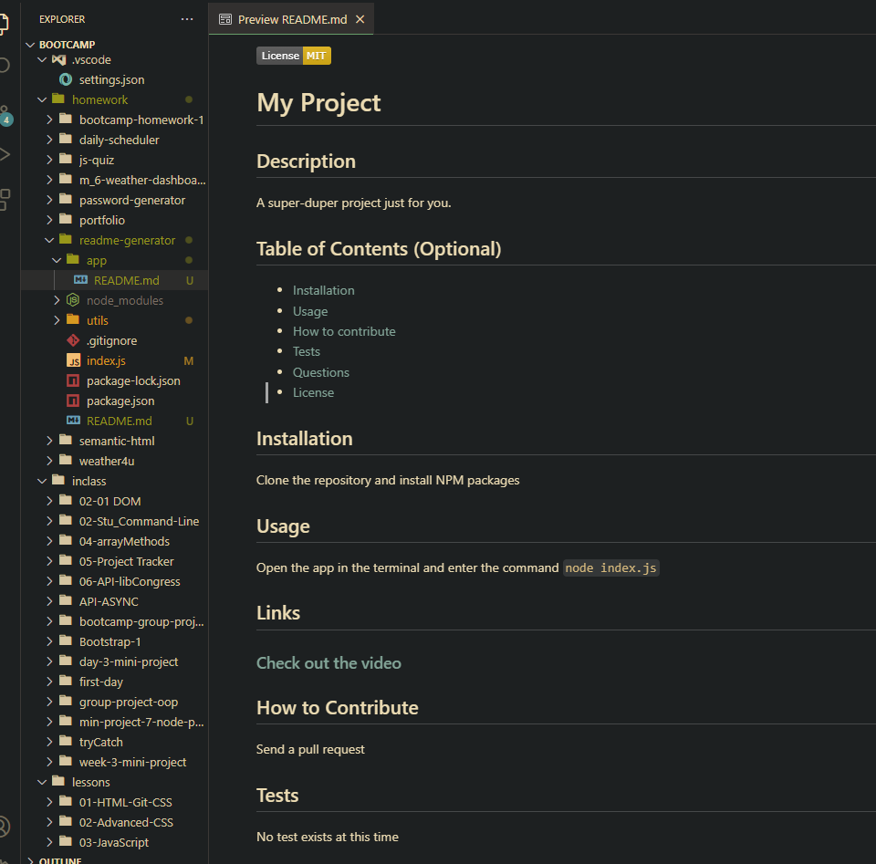

  
  # Speedy README
  
  ## Description
  A wicked helpful app for generating a bespoke README to meet all your app's needs!
  
  ## Table of Contents (Optional)
  
  - [Installation](#installation)
  - [Usage](#usage)
  - [How to contribute](#how-to-contribute)
  - [Tests](#tests)
  - [Questions](#questions)
  - [License](#license)
  
  ## Installation
  Simply clone the app repository and install the NPM packages. `npm install`
  
  ## Usage
  Open the app base directory in the terminal and enter the command `node index.js` to start the app. Follow the prompts in the terminal to build your README file today!
  
  ## Links
  ### [Check out the video](https://drive.google.com/file/d/1PYezY10Q31_FsnLcEDl45vwcDwGTxGuX/view)

  ## Screenshots
  ### The app in use
  
  ### README.md generated by the app
  
  ### Preview of the README
  
  
  ## How to Contribute
  Got contributions? We are now open for pull requests on Github. Contact me at the information given below to find out more.
  
  ## Tests
  No tests have been written for this app as yet.
  
  ## Questions
  email: [alex@alexgeerart.com](alex@alexgeerart.com)
  Github: [ag-bootcamp-umn](https://github.com/ag-bootcamp-umn)

  ## License
  Licensed under the [MIT](https://opensource.org/license/mit/) license.
  
  